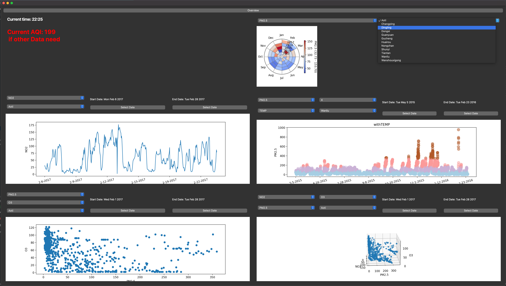
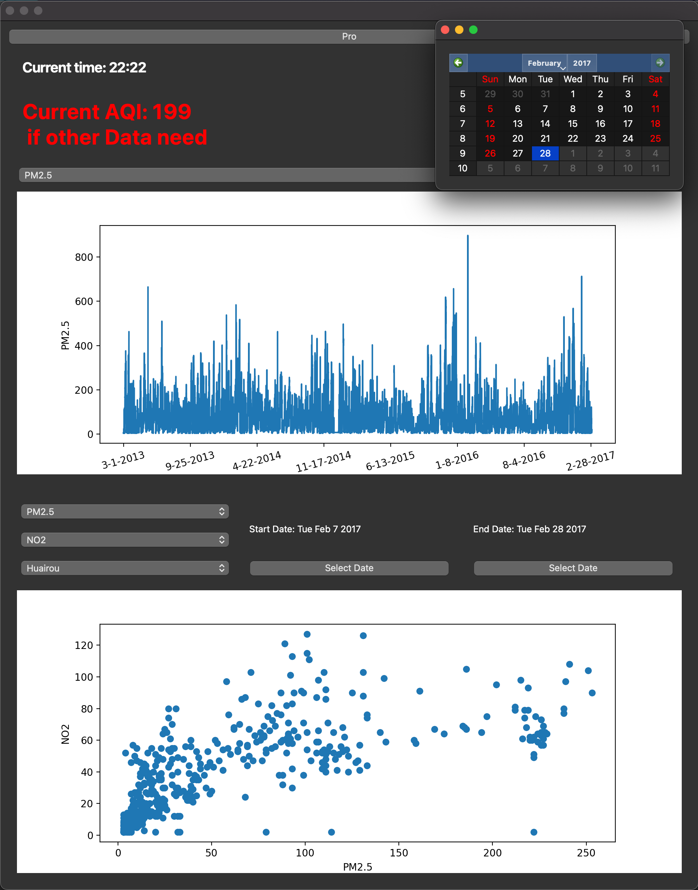

# Beijing-AQI-Visual-Analytics

This is visual analyse tool based on "Beijing Multi-Site Air-Quality Data Data Set". It provided overview mode and pro 
view mode for deep analyse. It was wirten for ECS273 Final Project.

## Getting Start

These instructions will get you a copy of the project up and running on your local machine for development and testing purposes.

### Introduction

This project currently contains two parts of documentation. 
The first part is labeled FIRST and is a complete interactive interface that does most of what we envisioned. 
This contains the two main interfaces, Overview and Proview. If you want to access this full interactive interface, 
download all the files marked first to the same folder (i.e. all the files in py form) and download the dataset linked below：
https://drive.google.com/file/d/1XmKqX4TytutTXL2hNn3R2FAkUNF9SuVM/view?usp=sharing

However, due to development time and development environment, some of the refined features were developed and tried separately,
but did not have the opportunity to be added to the overall interface. All ipynb files are the file we used to create views.
You can try downloading the ipynb files, 
they can all be run alone after downloading the prerequisite. 

### Prerequisites
- requests
- PyQt6
- matplotlib
- numpy
- panda
- csv
- folium
- sys
- io
- sklearn
- PIL
- seaborn
- ipywidgets
- IPython
- plotly
- branca

### Installing & Usage
There is no install process needed, just run the main.py file.

For the ipynb, run open the file and run all cells, the widget will show up.

## Contributing
All ipynb is contributed by Mo. All py files are contributed by Pu. But half of the code in corelate.py, 
c3d.py and back.py is modified from Mo's code. We consider our contribution in this project to be equal.

## Acknowledgments
Professor Kwan-Liu Ma and TA Yun-Hsin Kuo of this course at UC DAVIS

Dataset from: Song Xi Chen, Guanghua School of Management, Center for Statistical Science, Peking University.
